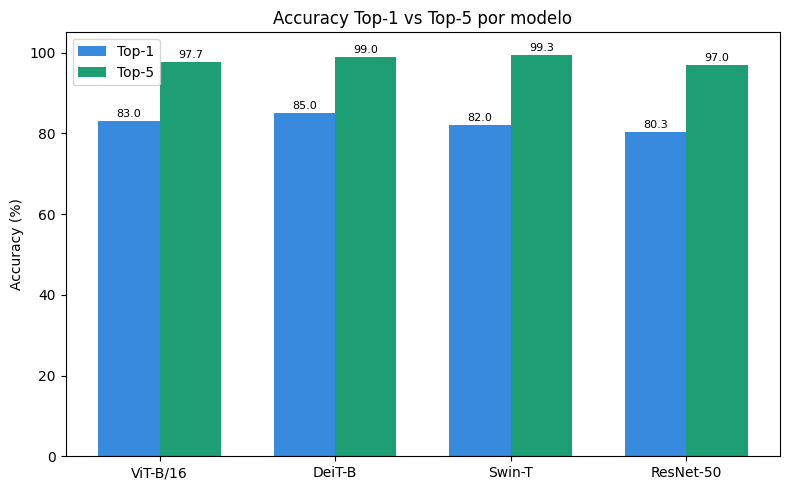
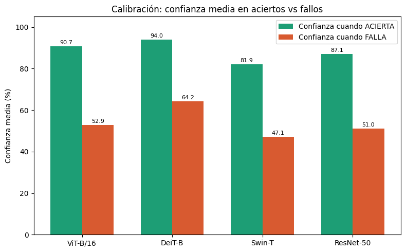
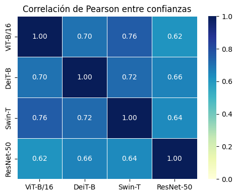
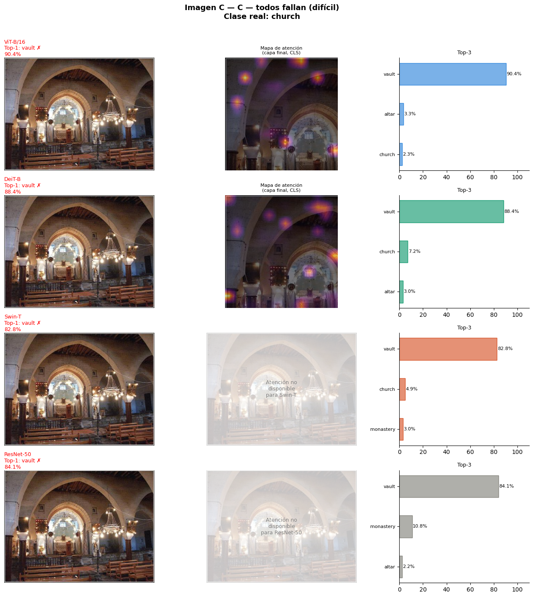

# Comparativa de Vision Transformers vs CNN: ViT · DeiT · Swin-T · ResNet-50

Comparación experimental de cuatro arquitecturas de clasificación de imágenes —tres Vision Transformers y una CNN clásica— evaluadas sobre el mismo conjunto de datos etiquetado, analizando no solo *cuánto aciertan* sino *cómo de fiable es su seguridad* y *dónde miran* para decidir.


[](https://colab.research.google.com/github/ddd96vc-netizen/programas/blob/main/Comparacion%20ViT%2C%20DeiT%2C%20Swin%20Transformer%20vs%20ResNet_50%20vision%20transformers%20comparison/Daniel_Duenas_AP_Codigo.ipynb)

---

## 🎯 Motivación

Desde 2020, los Vision Transformers proponen una alternativa a las CNN basada en atención global en lugar de convoluciones locales. Este proyecto compara cuatro modelos representativos de esa evolución —**ResNet-50** (CNN clásica, 2015), **ViT-B/16** (primer Transformer puro, 2020), **DeiT-B** (eficiente en datos vía destilación, 2021) y **Swin-T** (eficiente en cómputo vía ventanas de atención, 2021)— para entender su comportamiento real más allá del accuracy: rendimiento, **calibración** e **interpretabilidad**.

Trabajo basado en el survey [*Transformers for Vision*](https://ieeexplore.ieee.org/document/) (Palanisamy et al., IEEE Access, 2025).

## 🔬 Metodología

- **Dataset:** [Imagenette](https://github.com/fastai/imagenette) (10 clases de ImageNet), 30 imágenes/clase → 300 imágenes con etiqueta real.
- **Modelos:** los 4 preentrenados en ImageNet-1K, en modo evaluación, sin fine-tuning.
- **Métricas:** Accuracy Top-1/Top-5 · Confianza (softmax) · Calibración (confianza en aciertos vs. fallos) · Correlación de Pearson entre modelos · Mapas de atención (ViT/DeiT).

## 📊 Resultados

| Modelo | Acc. Top-1 | Acc. Top-5 | Conf. media |
|---|---|---|---|
| ViT-B/16 | 83.0% | 97.7% | 84.3% |
| **DeiT-B** | **85.0%** | 99.0% | 89.5% |
| Swin-T | 82.0% | **99.3%** | 75.7% |
| ResNet-50 | 80.3% | 97.0% | 80.0% |

*300 imágenes es una muestra pequeña: las diferencias de accuracy son indicativas, no concluyentes.*

<p align="center">
  
  
</p>

### 🔑 Hallazgo principal: accuracy alto ≠ confianza fiable

DeiT es el modelo con mejor accuracy, pero también el **peor calibrado**: cuando falla, sigue reportando un 64% de confianza (el resto cae a 47–53%). Es decir, su seguridad es la que menos avisa de un posible error — probablemente por efecto de la destilación de conocimiento, que produce distribuciones de probabilidad más "afiladas".

La correlación de confianza entre modelos también revela una **agrupación por familia arquitectónica**: los tres Transformers correlacionan más entre sí (0.70–0.76) que con la CNN (0.62–0.66), es decir, tienden a acertar y fallar en las mismas imágenes.

<p align="center">
  
</p>

### 🧠 Interpretabilidad: cuando la atención explica el error

En una imagen del interior de una iglesia, los cuatro modelos predicen erróneamente **"vault"** (bóveda) con confianza alta (82–90%). El mapa de atención de ViT/DeiT muestra por qué: el modelo se fija en el techo abovedado, una característica real de la imagen pero no la que define la clase "iglesia". El fallo es interpretable, no aleatorio.

<p align="center">
  
</p>

## 🛠️ Stack

`Python` · `PyTorch` · `🤗 Transformers` (ViT, DeiT, Swin) · `torchvision` (ResNet) · `matplotlib` / `seaborn`

## 🚀 Uso

**Opción rápida:** pulsa el badge *Open in Colab* de arriba y ejecuta las celdas en orden (recomendado — usa GPU gratuita de Colab).

**En local:**
```bash
pip install -r requirements.txt
jupyter notebook notebook.ipynb
```

El notebook descarga Imagenette automáticamente (sin necesidad de token de Kaggle) y ejecuta el pipeline completo: inferencia → métricas → visualizaciones → mapas de atención. En CPU la inferencia es lenta; se recomienda GPU (T4 gratuita en Colab es suficiente).

## 📁 Estructura

```
Comparacion ViT, DeiT, Swin Transformer vs ResNet_50/
├── Daniel_Duenas_AP_Codigo.ipynb   # Pipeline completo
├── figures/                          # Gráficos generados
├── requirements.txt
└── README.md
```

Este proyecto forma parte de mi [portafolio de proyectos](https://github.com/ddd96vc-netizen/programas).

## 📚 Referencias

- Palanisamy et al., *"Transformers for Vision: A Survey on Innovative Methods for Computer Vision"*, IEEE Access, 2025.
- Dosovitskiy et al., *"An Image is Worth 16x16 Words"* (ViT), 2020.
- Touvron et al., *"Training Data-Efficient Image Transformers & Distillation"* (DeiT), 2021.
- Liu et al., *"Swin Transformer: Hierarchical Vision Transformer using Shifted Windows"*, 2021.
- He et al., *"Deep Residual Learning for Image Recognition"* (ResNet), 2016.

---

<p align="center"><i>Daniel Dueñas Díaz — Proyecto de Aprendizaje Profundo, Universidad de Córdoba</i></p>
